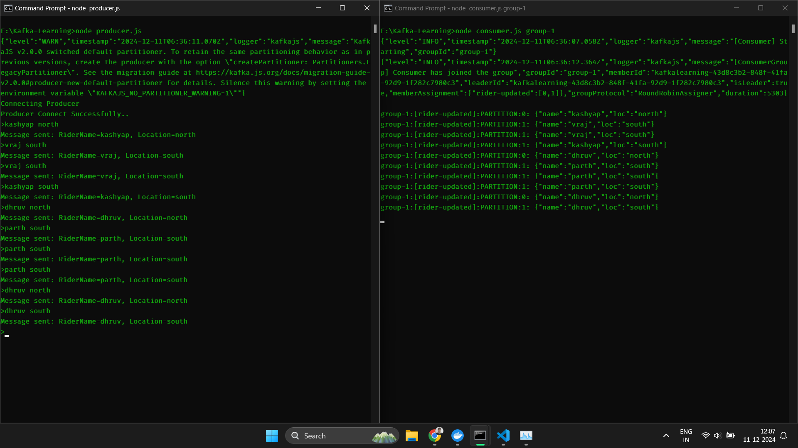

# Kafka Learning Project  📥🔗📤

Apache Kafka is a distributed event-streaming platform capable of handling trillions of events a day. It is widely used for building real-time data pipelines and streaming applications. Kafka's core strengths include high throughput, fault tolerance, scalability, and the ability to process data in real-time.

This project demonstrates the use of Kafka producers and consumers for message passing in distributed systems. Below are a couple of key images showcasing the project's setup and execution.

## Images

### Admin Dashboard

### Main Interface

## The above is main working of kafka.

---
Feel free to explore this repository and get hands-on with Kafka's powerful features!
